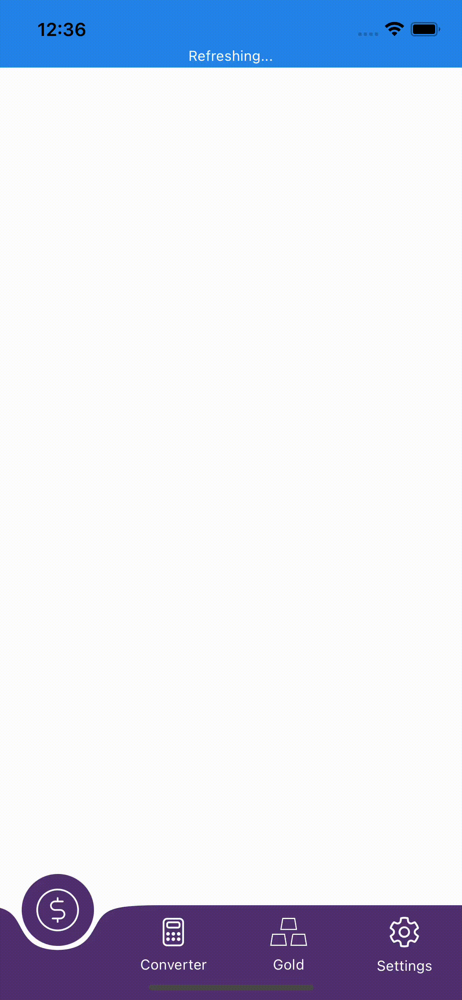

# React native animated tabbar

## Usage

> yarn add d3-shape react-native-svg
>
> yarn add rn-animated-tabbar
>
> cd ios && pod install

&nbsp;

## Define tabs data

```typescriptreact
const BottomTabsData = [
  {
    id: 'currency-tab',
    title: 'Currency',
    icon: Currency,
    activeIcon: CurrencyLG,
  },
  {
    id: 'converter-tab',
    title: 'Converter',
    icon: Converter,
    activeIcon: ConverterLG,
  },
  {
    id: 'gold-tab',
    title: 'Gold',
    icon: Gold,
    activeIcon: GoldLg,
  },
  {
    id: 'settings-tab',
    title: 'Settings',
    icon: Settings,
    activeIcon: SettingsLG,
  },
];
```

&nbsp;
&nbsp;

|     Property      |             Required              |                Description                    |
|-------------------|-----------------------------------|-----------------------------------------------|
|id                 |True                               |unique id for the tab                          |
|title              |True                               |tab name which will displayed                  |
|icon               |True                               |svg component to be displayed in inactive case |
|activeIcon         |True                               |svg component to be displayed in active case   |

&nbsp;
&nbsp;

```typescriptreact
import {BottomTabs} from 'rn-animated-tabbar';

<View style={{position: 'absolute', bottom: 0, right: 0, left: 0, backgroundColor: '#513070', paddingBottom: 16}}>
    <BottomTabs 
        tabsData={BottomTabsData} 
        tabBarBackground="#513070"
        activeTabBackground="#FFFFFF"
        textColor="#FFFFFF"
        navigationHandler={(screen: string) => { 
            // call your navigation method
        }}
    />
</View>
```

&nbsp;

## or using react navigation

```typescriptreact
import {createBottomTabNavigator} from '@react-navigation/bottom-tabs';
import {BottomTabs} from 'rn-animated-tabbar';

const TabsNavigator = createBottomTabNavigator();

<TabsNavigator.Navigator tabBar={() => (
    <BottomTabs 
        tabsData={BottomTabsData} 
        tabBarBackground="#513070"
        textColor="#FFFFFF"
        activeTabBackground="#FFFFFF"
        navigationHandler={(screen: string) => { 
            // call your navigation method
        }}
    />
)}
```

&nbsp;

## Demo


